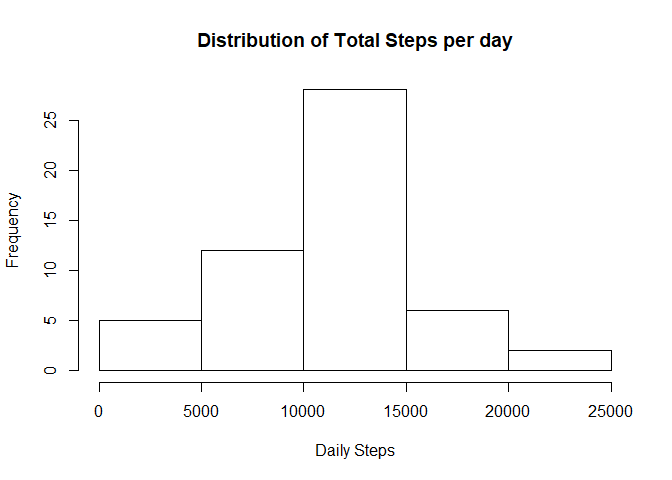
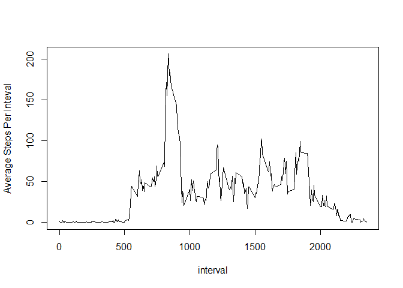
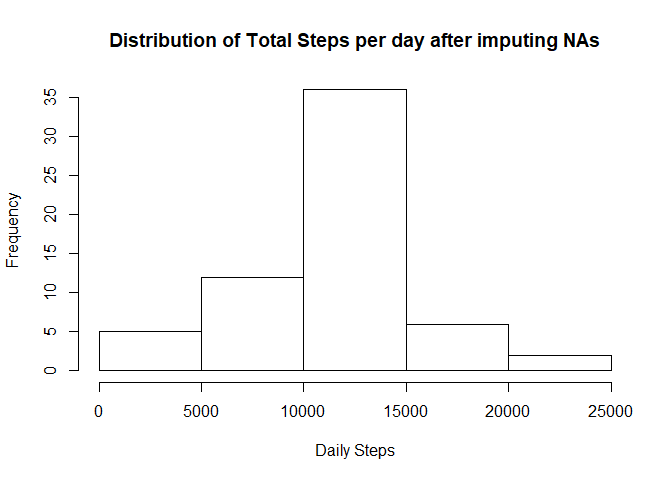
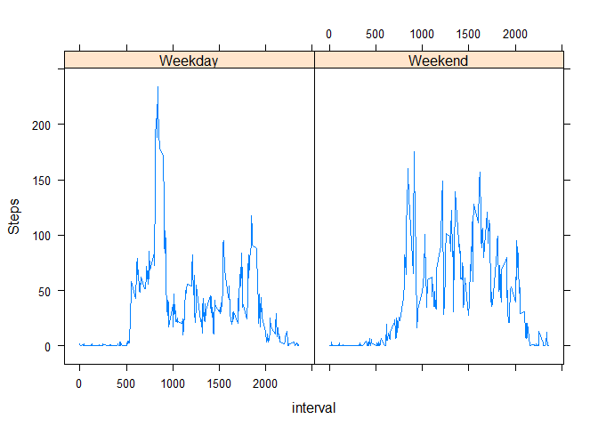

# Reproducible Research: Peer Assessment 1

### Set global options to echo the results

```r
knitr::opts_chunk$set(echo = TRUE)
```

## Loading and preprocessing the data
### Loading data and group the data by Day so that the histogram plotting the daily steps can be drawn

```r
unzip("activity.zip", overwrite = TRUE, exdir = "activity")
actdata <- read_csv("activity/activity.csv")
```

```
## Parsed with column specification:
## cols(
##   steps = col_integer(),
##   date = col_date(format = ""),
##   interval = col_integer()
## )
```

```r
actdataByDay <- group_by(actdata, date) %>% summarise(stepsTot = sum(steps))
hist(actdataByDay$stepsTot, xlab = "Daily Steps", main ="Distribution of Total Steps per day")
```

<!-- -->

## What is mean total number of steps taken per day?

### Mean Steps per day

```r
mean(actdataByDay$stepsTot, na.rm = TRUE)
```

```
## [1] 10766.19
```

### Median Steps per day


```r
median(actdataByDay$stepsTot, na.rm = TRUE)
```

```
## [1] 10765
```

## What is the average daily activity pattern?
### The following plot shows the avg steps taken per 5 min interval averaged across all days

```r
actdataByInterval <- group_by(actdata, interval) %>% summarise(avgStepsPerInt = mean(steps, na.rm = TRUE))
with(actdataByInterval, plot(interval, avgStepsPerInt, type = "l", ylab = "Average Steps Per Inteval"))
```

<!-- -->


```r
intervalWithMaxSteps <- arrange(actdataByInterval, desc(avgStepsPerInt))[1,]
```

### The interval with the maximum number of steps averaged across all days is <strong> 835 </strong> with <strong> 206.17 </strong>steps


## Imputing missing values
### Number of intervals with NA for steps is

```r
nrow(filter(actdata, is.na(steps)))
```

```
## [1] 2304
```

### imputing strategy is to get the average of the steps for an interval across all days and assign it to NA values


```r
avgSteps = round(mean(actdata$steps, rm.na = TRUE))
actdata2 <- actdata
actdata2$steps[is.na(actdata2$steps)] <- round(mean(actdata2$steps, na.rm = TRUE))
```

### Now plotting the total steps per day histogram again on the imputed dataframe and then calculating mean and median


```r
actdata2ByDay <- group_by(actdata2, date) %>% summarise(stepsTot = sum(steps))
hist(actdata2ByDay$stepsTot, xlab = "Daily Steps", main ="Distribution of Total Steps per day after imputing NAs")
```

<!-- -->

### Mean Steps per day on the imputed dataframe

```r
mean(actdata2ByDay$stepsTot, na.rm = TRUE)
```

```
## [1] 10751.74
```

### Median Steps per day on the imputed dataframe


```r
median(actdata2ByDay$stepsTot, na.rm = TRUE)
```

```
## [1] 10656
```

### The Histogram of the steps per day on the imputed dataset is less fatter than the original data set. In other words more days (approx 35) have steps closer to the average in the imputed dataset rather than days in the original dataset (approx 25). There isn't any significant different in the mean and median values.

## Are there differences in activity patterns between weekdays and weekends?

### creating a factor column 'Day' with 2 levels (weekday, weekend) and creating a panel plot to compare steps between weekday and weekend

```r
actdata$Day <- ifelse(weekdays(actdata$date) %in% c("Saturday", "Sunday"),"Weekend","Weekday")
actdata <- mutate(actdata, Day = factor(Day))
actdataByIntervalDay <- group_by(actdata, interval, Day) %>% summarise(avgStepsPerInt = mean(steps, na.rm = TRUE))
library(lattice)
xyplot(avgStepsPerInt ~ interval | Day, data = actdataByIntervalDay, type = "l", ylab = "Steps")
```

<!-- -->
